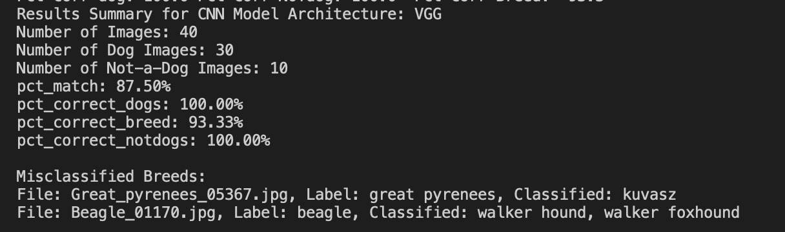
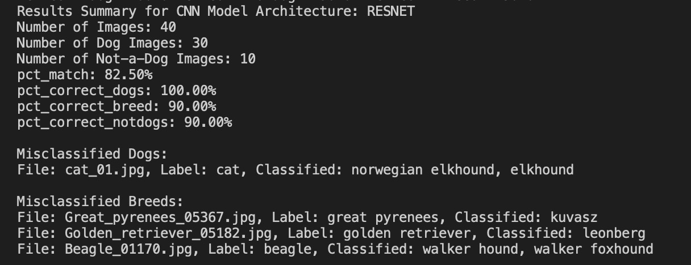
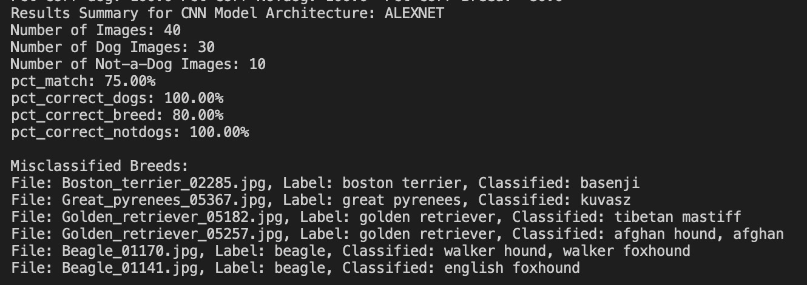

# Dog Breed Recognition using Deep Learning

A deep learning computer vision project for detecting dogs vs. non-dogs and classifying dog breeds using pretrained CNN architectures.

> **Udacity AI Programming with Python Nanodegree Project** — completed through the **Udacity AI/ML Scholarship**.

## Overview

This project evaluates pretrained convolutional neural network (CNN) architectures for identifying whether an input image contains a dog and, when it does, predicting the dog's breed.

The project compares three architectures:

- **AlexNet**
- **ResNet**
- **VGG**

## Project Goals

1. Detect whether an image contains a dog.
2. Classify the breed when the image contains a dog.
3. Compare AlexNet, ResNet, and VGG.
4. Evaluate model performance using dog detection, breed classification, and non-dog detection metrics.

## Model Comparison

| Model | Overall Match | Dog Detection | Breed Accuracy | Non-Dog Detection |
|---|---:|---:|---:|---:|
| **VGG** | **87.50%** | **100.00%** | **93.33%** | **100.00%** |
| **ResNet** | **82.50%** | **100.00%** | **90.00%** | **90.00%** |
| **AlexNet** | **75.00%** | **100.00%** | **80.00%** | **100.00%** |

Based on the evaluated image set, **VGG achieved the strongest overall results** among the three architectures.

## How It Works

1. Parse input arguments and image paths.
2. Load and organize image labels.
3. Use pretrained CNN models for image classification.
4. Determine whether each image contains a dog.
5. Predict the dog's breed when applicable.
6. Compare predictions with expected labels.
7. Calculate and report classification statistics.

## Results

### VGG

VGG achieved **87.50% overall match**, **100.00% dog detection**, **93.33% breed accuracy**, and **100.00% non-dog detection** on the evaluated image set.

### ResNet

ResNet achieved **82.50% overall match**, **100.00% dog detection**, **90.00% breed accuracy**, and **90.00% non-dog detection**.

### AlexNet

AlexNet achieved **75.00% overall match**, **100.00% dog detection**, **80.00% breed accuracy**, and **100.00% non-dog detection**.

## Technologies

- Python
- PyTorch
- Deep Learning
- Convolutional Neural Networks (CNNs)
- Computer Vision
- Pretrained Models
- Transfer Learning

## Project Structure

The repository contains the core Python modules used for image labeling, model classification, statistics calculation, and result reporting.

Key files include:

- `classifier.py` — image classification using pretrained models
- `classify_images.py` — runs image classification
- `get_pet_labels.py` — extracts labels from image filenames
- `adjust_results4_isadog.py` — evaluates dog/non-dog predictions
- `calculates_results_stats.py` — calculates evaluation statistics
- `print_results.py` — reports model results
- `get_input_args.py` — handles command-line arguments
- `test_classifier.py` — tests classifier functionality
- `dognames.txt` — dog-breed labels
- `imagenet1000_clsid_to_human.txt` — ImageNet class labels

## Key Learning Outcomes

Through this project, I practiced:

- Working with pretrained deep learning models.
- Applying CNNs to computer vision classification tasks.
- Building a modular Python machine learning workflow.
- Evaluating model performance using multiple metrics.
- Comparing different neural network architectures.
- Interpreting classification results and model performance.
- Working with image classification using PyTorch.

## Background

This project was completed as part of the **Udacity AI Programming with Python Nanodegree**, which I completed through the **Udacity AI/ML Scholarship**.

## Future Improvements

Potential improvements include:

- Testing additional pretrained architectures.
- Evaluating models on a larger and more diverse dataset.
- Applying additional data preprocessing and augmentation.
- Experimenting with fine-tuning pretrained models.
- Improving breed-level classification performance.

## Author

**Alisha Iftikhar**

Computer Science Student | AI/ML | Computer Vision | Python
